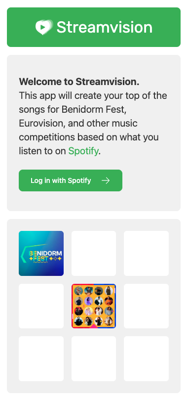
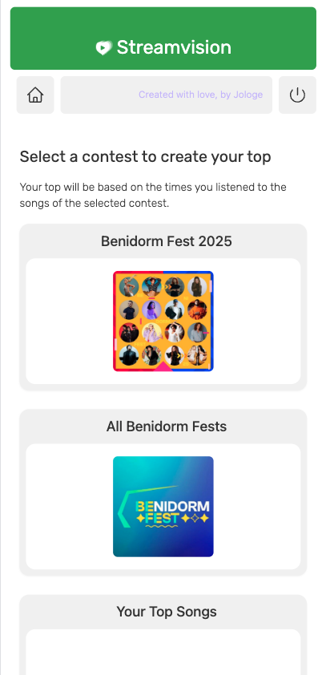
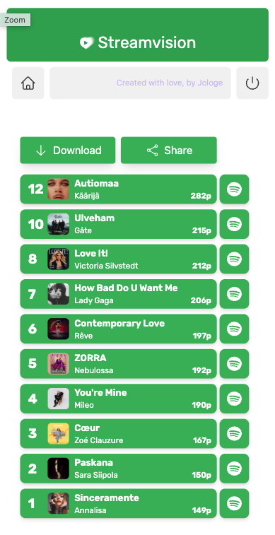
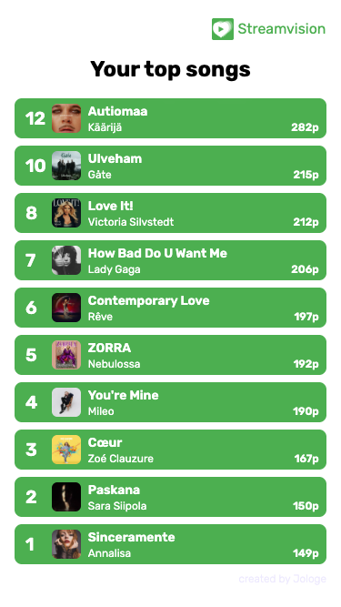
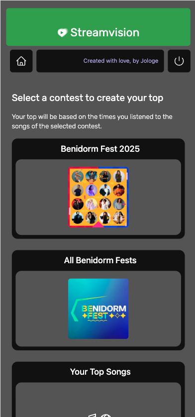

# Spotivision

Disclaimer: the project has to be approved by Spotify to work with their API, so it has not been deployed anywhere yet.

Spotivision is an app to create your top from Spotify playlists by ranking them based on your listening records.

## Use guide

1. Login with Spotify and accept the API read permissions.

2. Go to the playlist you want to see your top from.

3. See your top and share it by downloading it as an image.

## Developer guide

It runs on NextJS, so you need to have installed NodeJS and NPM (or similar).

Check the scripts in the package.json to use it.

Your env file will need the following vars:

- 'production': false for dev and QA environments
- 'NEXT_PUBLIC_client_id': Spotify client ID, from the account you will grant API permissions
- 'NEXT_PUBLIC_redirect_url': Your deployed app's URL to be redirected to after the Spotify login. The Spotify token will be included in the URL as a parameter.

## Screenshots

### Login with Spotify

### Main screen

### Top screen

### Downloaded top

### Dark mode available

